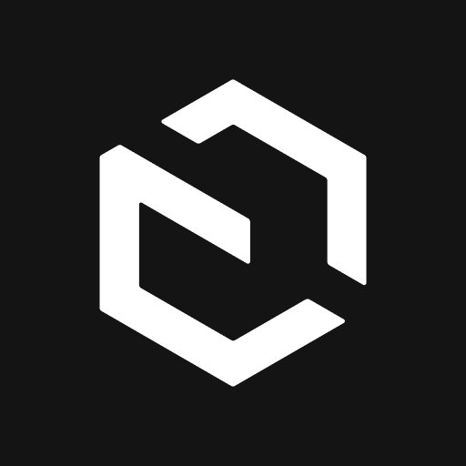
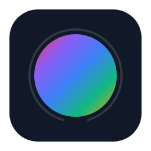

# **CODE JOURNEY**
### **Senior Full-Stack Engineer** • **Open Source**
#### *Crafting high-performance digital experiences with a human-centric approach.*

## **Philosophy & Approach**
I believe that code is only as good as the problem it solves. My approach focuses on **purpose-driven engineering** bridging the gap between complex infrastructure and human-centric design. I don’t just deliver projects; I architect scalable futures that grow with your vision.

## **Technical Ecosystem**
I specialize in high-performance stacks designed for speed, reliability, and developer experience.

| Frontend | Backend | Database | CMS | DevOps |
| :--- | :--- | :--- | :--- | :--- |
|  React |  Node.js |  PostgreSQL |  Sanity |  Vercel |
|  Next.js |  NestJS |  MongoDB |  Strapi |  AWS |
|  TypeScript |  Go |  Redis |  Payload |  Docker |
|  Tailwind |  Express |  MySQL | |  GIthub Actions |

## Featured Open Source
I believe in giving back to the community that builds the web.

|  |  |
| :--- | :--- |
| **[sanity-plugin-color-input](https://www.sanity.io/plugins/sanity-plugin-color-input)** | **[sanity-plugin-smart-asset-manager](https://www.sanity.io/plugins/sanity-plugin-smart-asset-manager)** |

## Services for Growing Businesses

| Expertise | Value Provided |
| :--- | :--- |
| **Enterprise Web Development** | Scalable, SEO-optimized platforms built with Next.js. |
| **Bento-style UI/UX** | Modern, grid-based layouts that drive conversion and engagement. |
| **Headless CMS Strategy** | Empowering teams to manage content without developer friction. |
| **Custom Automation** | Reducing operational overhead with bespoke internal tools. |
| **Cloud-Native Design** | Resilient backend architectures designed for zero downtime. |

---

## Deep Dives & Insights
I share my journey and technical insights to help other developers grow.

 

---

## Let’s Start Your Journey
I’m currently taking on new projects and architectural consultations.

  

*"Transparency is my default. I don't just solve problems; I explain the 'why' so you're never in the dark."*

---

© 2026 Code Journey · Crafting digital excellence from India to the World
